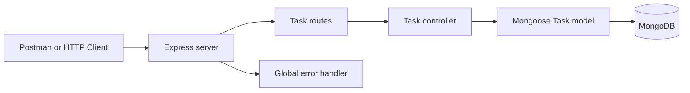

# Collaborative To-Do List REST API
## Academic Project Report

> Replace every bracketed placeholder before submission. Insert your own screenshots at the marked locations.

---

# Page 1 - Cover Page

**Project title:** Collaborative To-Do List REST API  
**Student name:** [Student Name]  
**Student ID:** [Student ID]  
**Course/module:** [Course or Module Name]  
**Lecturer:** [Lecturer Name]  
**College/university:** [College or University]  
**Submission date:** [Submission Date]

---

# Page 2 - Introduction

A REST API is a software interface that allows applications to communicate through standard HTTP requests and resources. This project provides a task resource through predictable endpoints. REST is appropriate because clients can create, read, update, and delete resources using standard methods such as POST, GET, PATCH, and DELETE.

The purpose of this API is to provide the backend for a collaborative To-Do List application. A client can create tasks, view tasks, filter them by completion state, update task details, and delete tasks. Database persistence is important because tasks must remain available after the server restarts. MongoDB stores the task documents permanently rather than keeping them only in application memory.

The main objectives were to build a modular API, validate incoming data, return suitable status codes, handle errors safely, and demonstrate the complete CRUD lifecycle. The API uses JSON so it can be consumed by Postman, a web frontend, or another client application.

---

# Page 3 - Implementation Details

The technology stack is Node.js, Express.js, MongoDB, Mongoose, dotenv, JavaScript, and Postman. Express provides routing and middleware support (Express.js, n.d.). Mongoose provides the schema and model layer used to validate task documents and communicate with MongoDB (Mongoose, n.d.).

The Task schema contains a required trimmed title with a maximum length of 100 characters, an optional description, an `isCompleted` Boolean defaulting to false, an optional due date, and automatic `createdAt` and `updatedAt` timestamps. The MongoDB ObjectId is generated automatically.

The project separates responsibilities. `server.js` loads configuration, connects to MongoDB, parses JSON, mounts routes, and starts the server. `taskRoutes.js` defines the HTTP paths. `taskController.js` contains CRUD behavior. `Task.js` defines the database model. `errorHandler.js` provides centralized safe error responses. Query and ObjectId validation occur before database operations where appropriate.



---

# Page 4 - API Implementation and Testing

`POST /api/tasks` creates a task and returns the document with status 201. Missing, empty, or overlong titles produce status 400. `GET /api/tasks` returns every task with status 200. The optional `completed=true` or `completed=false` query filters the collection; any other value produces status 400.

`GET /api/tasks/:id` returns one task with status 200, status 400 for an invalid ObjectId, and status 404 when no document matches. `PATCH /api/tasks/:id` changes only submitted fields and runs Mongoose validators. `DELETE /api/tasks/:id` permanently removes a matching task and returns a confirmation message.

**Screenshot placeholders:**

- [Insert Figure 1: server.js and route registration]
- [Insert Figure 2: Task model]
- [Insert Figure 3: Successful POST response]
- [Insert Figure 4: GET and filtered GET responses]
- [Insert Figure 5: PATCH and DELETE responses]
- [Insert Figure 6: Validation and 404 error responses]

Testing was performed with the supplied Postman collection. The create request stores its returned ID in a collection variable so subsequent requests can be demonstrated efficiently.

---

# Page 5 - Results and Discussion

The implementation successfully provides the required CRUD operations. A valid task can be created and later retrieved from MongoDB. The timestamps demonstrate that Mongoose maintains creation and update history automatically. Filtering returns completed and incomplete tasks separately.

Validation prevents missing titles, empty titles after trimming, titles over 100 characters, invalid Boolean query values, and invalid task IDs. A valid but unknown ID returns 404. Unexpected errors are logged for development while clients receive the clean message `Internal server error` rather than a stack trace.

## Testing result table

| Test case | Expected result | Actual result | Pass/Fail |
|---|---|---|---|
| Create valid task | 201 and task object | [Record result] | [ ] |
| Get all tasks | 200 and array | [Record result] | [ ] |
| Filter completed tasks | 200 and completed items | [Record result] | [ ] |
| Update existing task | 200 and updated object | [Record result] | [ ] |
| Delete existing task | 200 confirmation | [Record result] | [ ] |
| Missing title | 400 message | [Record result] | [ ] |
| Invalid ID | 400 message | [Record result] | [ ] |
| Missing task | 404 message | [Record result] | [ ] |

Database persistence should be demonstrated by showing the POST response, the saved MongoDB document, the updated document after PATCH, and the absence of the document after DELETE. **GitHub repository:** [Insert public repository URL].

---

# Page 6 - Conclusion and References

This project achieved a modular REST API for collaborative task management. It demonstrated CRUD operations, MongoDB persistence, Mongoose schema validation, filtered queries, centralized error handling, and meaningful HTTP status codes. The project also strengthened understanding of how routes, controllers, models, middleware, and environment configuration work together.

Validation and persistence are especially important because they protect data quality and ensure that user data survives beyond one server process. Future improvements could include authentication, JWT authorization, user-specific ownership, collaboration permissions, pagination, search, sorting, rate limiting, Swagger documentation, automated tests, cloud deployment, and a React frontend.

## References

Express.js. (n.d.). *Using middleware*. Retrieved August 24, 2026, from https://expressjs.com/en/guide/using-middleware.html

Mongoose. (n.d.). *Mongoose ODM documentation*. Retrieved August 24, 2026, from https://mongoosejs.com/docs/guide.html

## Screenshot captions

Figure 1. Project folder structure.  
Figure 2. `package.json` configuration.  
Figure 3. `server.js` application startup.  
Figure 4. Task schema implementation.  
Figure 5. Task controller implementation.  
Figure 6. Task routes implementation.  
Figure 7. MongoDB connection configuration.  
Figure 8. Global error middleware.  
Figure 9. Successful task creation using POST.  
Figure 10. Retrieving all tasks using GET.  
Figure 11. Filtering tasks using GET.  
Figure 12. Retrieving one task.  
Figure 13. Updating a task using PATCH.  
Figure 14. Deleting a task using DELETE.  
Figure 15. Validation error response.  
Figure 16. Not-found error response.  
Figure 17. Saved task in MongoDB.  
Figure 18. Public GitHub repository.

## 3-5 minute video script

- **0:00-0:30:** Introduce the API, Node.js, Express, MongoDB, and Mongoose.
- **0:30-1:00:** Show the project structure and explain server, routes, controllers, model, middleware, and database configuration.
- **1:00-1:30:** Show the MongoDB task collection and successful connection message.
- **1:30-2:30:** Demonstrate POST, GET all, filtered GET, GET one, PATCH, and DELETE in Postman.
- **2:30-3:15:** Demonstrate missing title, invalid ID, and non-existing task responses.
- **3:15-4:00:** Show database records before and after update and deletion.
- **4:00-4:30:** Show the public GitHub repository and explain that `.env` is excluded.
- **4:30-5:00:** Conclude that CRUD, validation, persistence, status codes, and error handling were demonstrated.

## Viva questions and short answers

1. **What is a REST API?** An interface that exposes resources through standard HTTP methods and URLs.
2. **Why Express.js?** It is lightweight and provides clear routing and middleware support.
3. **Why MongoDB?** It stores flexible JSON-like task documents persistently.
4. **What is Mongoose?** An ODM that provides schemas, validation, and MongoDB access from Node.js.
5. **POST versus GET?** POST creates data; GET reads data.
6. **What is PATCH?** It partially updates an existing resource.
7. **Why DELETE?** It removes a resource permanently.
8. **What is 201?** The request successfully created a resource.
9. **What is 400?** The client sent invalid input.
10. **What is 404?** The requested resource or route was not found.
11. **What is 500?** The server experienced an unexpected error.
12. **Why middleware?** Middleware processes requests or errors in reusable stages.
13. **Why `express.json()`?** It parses JSON request bodies into `request.body`.
14. **Why environment variables?** They keep configuration outside source code.
15. **Why exclude `.env`?** It may contain private database credentials.
16. **What is CRUD?** Create, Read, Update, and Delete.
17. **How does it connect to MongoDB?** `config/db.js` reads `MONGODB_URI` and calls `mongoose.connect`.
18. **How is title validation implemented?** The Mongoose schema requires, trims, and limits title length.
19. **How does filtering work?** The controller validates `completed` and maps it to `isCompleted`.
20. **What happens with an invalid ID?** The API returns 400 without querying with an unsafe ID.
21. **What is global error handling?** One middleware formats errors consistently for all routes.
22. **How was it tested?** With Postman requests and negative validation cases.
23. **How was persistence proven?** The task was shown in MongoDB before update and after deletion.
24. **Why PATCH instead of PUT?** PATCH changes only supplied fields.
25. **What would you improve?** Authentication, ownership, pagination, automated tests, and a frontend.

## Final submission checklist

- [ ] MongoDB connected
- [ ] Task model and timestamps created
- [ ] All CRUD endpoints completed
- [ ] Filtering and validation implemented
- [ ] 400, 404, and 500 responses implemented
- [ ] JSON middleware, controllers, and routes implemented
- [ ] Postman collection and `api.http` created
- [ ] README and database guide completed
- [ ] `.env.example` and `.gitignore` created
- [ ] Positive and negative testing completed
- [ ] Persistence demonstrated
- [ ] Screenshots captured with captions
- [ ] GitHub repository created and made public
- [ ] Report completed with two APA 7 sources and in-text citations
- [ ] 3-5 minute video recorded
- [ ] Project ready for submission

## GitHub commands

```bash
git init
git add .
git commit -m "Initial REST API project"
git branch -M main
git remote add origin YOUR_GITHUB_URL
git push -u origin main
```
